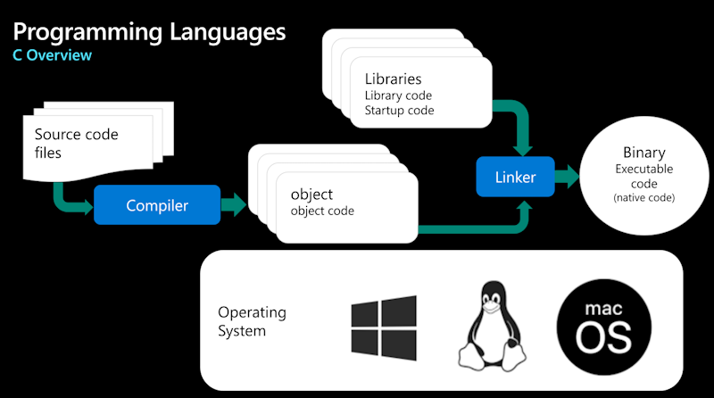
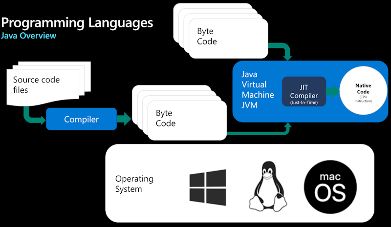
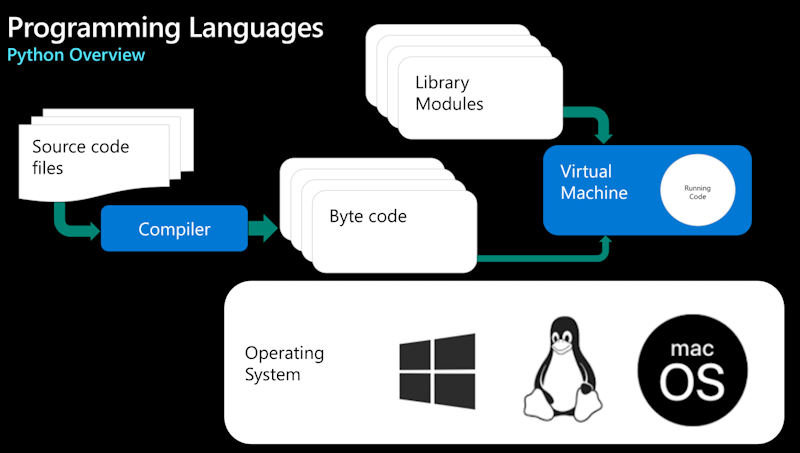
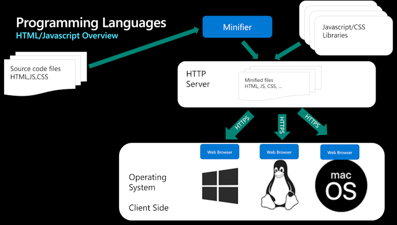

# Hello World Journey

Be part of the journey and get started exploring Programming languages, source code, tools, cloud,...

## Getting Started

In this repository, you'll find scripts, source code files to build Hello World applications in different Programming Languages.

Some Hello World applications will be deployed in the cloud.

This chapter describes how to :

1. Install the pre-requisites including Visual Studio Code, Dev Container
2. Install the tools associated with each Programming Language
3. Build and run the Hello World applications
  
This repository contains the following resources :

- A Dev container under '.devcontainer' folder
- The source code of the Hello World applications in different languages under 'src' folder

### Installing the pre-requisites

In order to test the solution, you need first an Azure Subscription, you can get further information about Azure Subscription [here](https://azure.microsoft.com/en-us/free).

You also need to install Git client and Visual Studio Code on your machine, below the links.

|[](https://git-scm.com/download/win) |[](https://git-scm.com/download/linux)|[](https://git-scm.com/download/mac)|
|:---|:---|:---|
| [Git Client for Windows](https://git-scm.com/download/win) | [Git client for Linux](https://git-scm.com/download/linux)| [Git Client for MacOs](https://git-scm.com/download/mac) |
[Visual Studio Code for Windows](https://code.visualstudio.com/Download)  | [Visual Studio Code for Linux](https://code.visualstudio.com/Download)  &nbsp;| [Visual Studio Code for MacOS](https://code.visualstudio.com/Download) &nbsp; &nbsp;|

Once the Git client is installed you can clone the repository on your machine running the following commands:

1. Create a Git directory on your machine

    ```bash
        c:\> mkdir git
        c:\> cd git
        c:\git>
    ```

2. Clone the repository.  
    For instance:

    ```bash
        c:\git> git clone  https://github.com/flecoqui/HelloWorld.git 
        c:\git> cd ./HelloWorld
        c:\git\HelloWorld> 
    ```

### Using Dev Container

#### Installing Dev Container pre-requisites

You need to install the following pre-requisite on your machine

1. Install and configure [Docker](https://www.docker.com/get-started) for your operating system.

   - Windows / macOS:

     1. Install [Docker Desktop](https://www.docker.com/products/docker-desktop) for Windows/Mac.

     2. Right-click on the Docker task bar item, select Settings / Preferences and update Resources > File Sharing with any locations your source code is kept. See [tips and tricks](https://code.visualstudio.com/docs/remote/troubleshooting#_container-tips) for troubleshooting.

     3. If you are using WSL 2 on Windows, to enable the [Windows WSL 2 back-end](https://docs.docker.com/docker-for-windows/wsl/): Right-click on the Docker taskbar item and select Settings. Check Use the WSL 2 based engine and verify your distribution is enabled under Resources > WSL Integration.

   - Linux:

     1. Follow the official install [instructions for Docker CE/EE for your distribution](https://docs.docker.com/get-docker/). If you are using Docker Compose, follow the [Docker Compose directions](https://docs.docker.com/compose/install/) as well.

     2. Add your user to the docker group by using a terminal to run: 'sudo usermod -aG docker $USER'

     3. Sign out and back in again so your changes take effect.

2. Ensure [Visual Studio Code](https://code.visualstudio.com/) is already installed.

3. Install the [Remote Development extension pack](https://marketplace.visualstudio.com/items?itemName=ms-vscode-remote.vscode-remote-extensionpack)

#### Using Visual Studio Code and Dev Container

1. Launch Visual Studio Code in the folder where you cloned the 'ps-data-foundation-imv' repository

    ```bash
        c:\git\HelloWorld> code .
    ```

2. Once Visual Studio Code is launched, you should see the following dialog box:

    

3. Click on the button 'Reopen in Container'
4. Visual Studio Code opens the Dev Container. If it's the first time you open the project in container mode, it first builds the container, it can take several minutes to build the new container.
5. Once the container is loaded, you can open a new terminal (Terminal -> New Terminal).
6. And from the terminal, you have access to the tools installed in the Dev Container like az client,....

    ```bash
        vscode ➜ /workspace/HelloWorld $ az login 
    ```

## C



### Install C compilers and linkers

#### Install gcc on Windows

1. Information about the GCC compiler on Windows available here:
     https://www.mingw-w64.org/

2. Install MSYS2 on your machine
    Information: https://www.msys2.org/ 
    Binaries: https://github.com/msys2/msys2-installer/releases/download/2024-05-07/msys2-x86_64-20240507.exe 

3. Install GCC in MSYS2 shell terminal:

```bash
    pacman -S mingw-w64-ucrt-x86_64-gcc
```

4. Run GCC:

```bash
   gcc –version
   gcc.exe (Rev6, Built by MSYS2 project) 13.2.0
Copyright (C) 2023 Free Software Foundation, Inc.
This is free software; see the source for copying conditions.  There is NO
warranty; not even for MERCHANTABILITY or FITNESS FOR A PARTICULAR PURPOSE.
```

#### Install gcc on Linux

1. Update packages list, install build-essential and documentation:

```bash
    $ sudo apt update
    $ sudo apt install build-essential
    $ sudo apt-get install manpages-dev
    $ gcc --version
```

### Sample 1: Hello World

**Source code: [test.c](./src/c/test1/test.c)**

```c
    #include "stdio.h"
    int main()
    {
        printf("Hello World\n");
    }
```

**build command:**

```bash
    gcc test.c  -o test.exe 
```

**build command to optimize size:**

```bash
    gcc test.c  -o testsmall.exe  -O2 -s
```

**build command to generate assembly code:**

```bash
    gcc -o test.asm  -S  test.c
```

**assembly code with gcc running on Linux:**

```asm
        .file	"test.c"
        .text
        .section	.rodata
    .LC0:
        .string	"Hello World"
        .text
        .globl	main
        .type	main, @function
    main:
    .LFB0:
        .cfi_startproc
        endbr64
        pushq	%rbp
        .cfi_def_cfa_offset 16
        .cfi_offset 6, -16
        movq	%rsp, %rbp
        .cfi_def_cfa_register 6
        leaq	.LC0(%rip), %rax
        movq	%rax, %rdi
        call	puts@PLT
        movl	$0, %eax
        popq	%rbp
        .cfi_def_cfa 7, 8
        ret
        .cfi_endproc
    .LFE0:
        .size	main, .-main
        .ident	"GCC: (Ubuntu 11.4.0-1ubuntu1~22.04) 11.4.0"
        .section	.note.GNU-stack,"",@progbits
        .section	.note.gnu.property,"a"
        .align 8
        .long	1f - 0f
        .long	4f - 1f
        .long	5
    0:
        .string	"GNU"
    1:
        .align 8
        .long	0xc0000002
        .long	3f - 2f
    2:
        .long	0x3
    3:
        .align 8
    4:

```

**assembly code with gcc running on Windows:**

```asm
        .file	"test.c"
        .text
        .def	__main;	.scl	2;	.type	32;	.endef
        .section .rdata,"dr"
    .LC0:
        .ascii "Hello World\0"
        .text
        .globl	main
        .def	main;	.scl	2;	.type	32;	.endef
        .seh_proc	main
    main:
                                                                                        
        .seh_pushreg	%rbp
        movq	%rsp, %rbp
        .seh_setframe	%rbp, 0
        subq	$32, %rsp
        .seh_stackalloc	32
        .seh_endprologue
        call	__main
        leaq	.LC0(%rip), %rax
        movq	%rax, %rcx
        call	puts
        movl	$0, %eax
        addq	$32, %rsp
        popq	%rbp
        ret
        .seh_endproc
        .ident	"GCC: (Rev6, Built by MSYS2 project) 13.2.0"
        .def	puts;	.scl	2;	.type	32;	.endef

```


### Sample 2: Optimize size

**Source code: test.c**

```c
    #include "stdio.h"
    int main()
    {
        printf("Hello World\n");
    }
```

**build command to optimize size:**

```bash
    gcc test.c -o testO.exe -O2 -s
```

**build command to generate assembly code:**

```bash
    gcc -o test.asm  -S  test.c
```

### Sample 3: Enter risky string

### Sample 4: Enter secure string

### Sample 5: Key Stroke Windows in while loop

### Sample 6: Key Stroke Linux in while loop

## C#


### Install DotNet SDK

### Sample 1: Hello World

### Sample 2: Self Contained Binary

### Sample 3: Key Stroke detection

### Sample 4: Enter string

### Sample 5: Key Stroke in while loop

## java



### Install Java SDK

### Sample 1: Hello World

### Sample 2: Self Contained Binary

### Sample 3: Key Stroke detection

### Sample 4: Enter string

### Sample 5: Key Stroke in while loop

## python



### Install Python SDK

### Sample 1: Hello World

### Sample 2: Key Stroke detection

### Sample 3: Enter string

### Sample 4: Key Stroke in while loop

## HTML/Javascript

### Install HTML/Javascript SDK



### Sample 1: Hello World

### Sample 2: Key Stroke detection

### Sample 3: Enter string

### Sample 4: Key Stroke in while loop